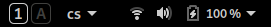

## simple-keys-indicator
GNOME Shell extension that displays <kbd>CapsLock</kbd> and <kbd>NumLock</kbd> status



## Install
See (and run) ```install.sh``` script

The extension is installed to ```~/.local/share/gnome-shell/extensions```

Before you can use it you have to logout first (or reboot, or restart the universe, multiple times)

And only then you can enable it in ```gnome-extensions-app```

## Why?
Less code means smaller attack vector for the GNOME Shell devs

Inspired by (at the time of writing broken) [keys-indicator@caasiu.github.com](https://github.com/caasiu/gnome-shell-extension-KeysIndicator)